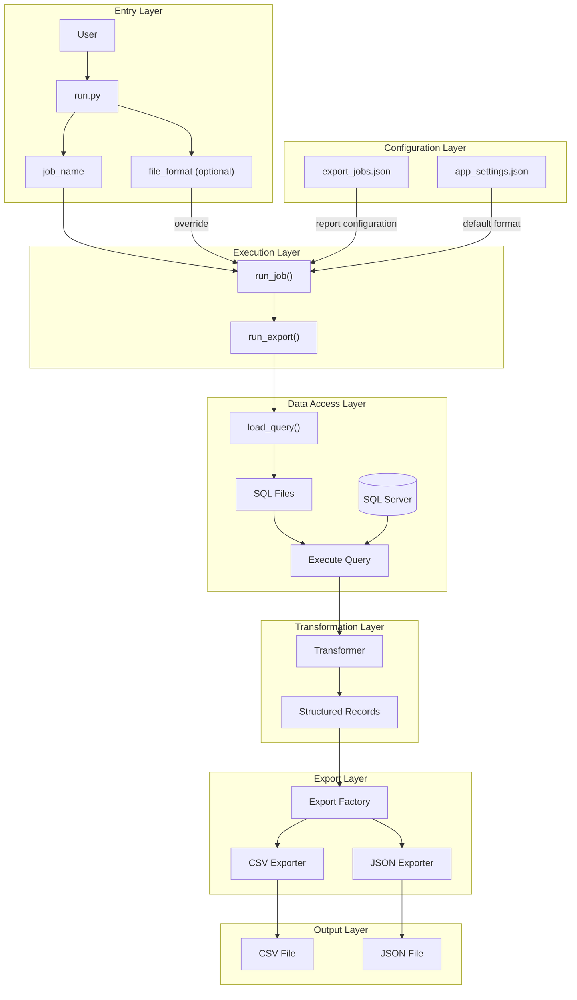

# Data Portfolio

## Project Overview

This project is a configuration-driven ETL pipeline built with Python and SQL Server. It executes analytical SQL queries, transforms the returned data into structured records, and exports the results in multiple output formats.

The project was designed with maintainability and extensibility in mind. New reports can be added through configuration without modifying the core execution pipeline, while additional export formats can be introduced by extending the export layer.

The primary goal of this project is to demonstrate clean software architecture, modular design, and practical data engineering principles in a portfolio-ready application.


## Key Highlights

* Configuration-driven ETL pipeline
* SQL Server integration with Python
* Generic query execution engine
* Pluggable data transformation layer
* Factory pattern with pluggable exporters
* Multiple export formats (CSV and JSON)
* 10 analytical reports built on AdventureWorks
* Modular and extensible architecture


## Features

* Execute analytical SQL queries against SQL Server.
* Transform query results into structured Python records.
* Export reports to multiple output formats (CSV and JSON).
* Configure export jobs without modifying application code.
* Select output format through configuration or command-line arguments.
* Add new reports by creating a SQL query and a transformer.
* Extend export capabilities using the Strategy and Factory patterns.
* Generate analytical reports from the AdventureWorks sample database.


## Project Architecture

The following diagram illustrates the execution flow and module boundaries of the application.




## Project Structure

```text
data-portfolio/
│
├── config/
│   ├── app_settings.json
│   └── export_jobs.json
│
├── data/
│
├── python/
│   ├── run.py
│   │
│   ├── config/
│   ├── database/
│   ├── export/
│   │   └── exporters/
│   └── transform/
│
├── sql/
│
└── README.md
```

### Python Package Overview

| Module             | Responsibility                           |
| ------------------ | ---------------------------------------- |
| `run.py`           | Application entry point                  |
| `config`           | Load application and job configuration   |
| `database`         | Database connection and SQL loading      |
| `transform`        | Convert SQL rows into structured records |
| `export`           | Export pipeline orchestration            |
| `export.exporters` | CSV and JSON exporters                   |


## Technologies

- Python 3.13
- Microsoft SQL Server
- pyodbc
- JSON
- CSV
- Git
- GitHub

## Installation

```bash
git clone https://github.com/resmaeeli/data-portfolio.git

cd data-portfolio

python -m venv .venv

source .venv/Scripts/activate

pip install -r requirements.txt
```

## Configuration

The project uses two configuration files.

- `config/export_jobs.json` defines available reports, SQL queries, transformers, output files, and optional output formats.
- `config/app_settings.json` stores application-level settings such as the default export format.

## Usage

Run a report using the default output format:

```bash
python python/run.py orders_per_year
```

Specify the export format explicitly:

```bash
python python/run.py monthly_sales_growth json
```

Supported output formats:

- csv
- json

## Sample Output

The project generates structured reports in both **CSV** and **JSON** formats.

### Orders Per Year (CSV)

```csv
Year,Count
2011,1607
2012,3915
2013,14182
2014,11761
```

---

### Top 10 Customers (CSV)

```csv
StoreName,PersonName,TotalPurchasedAmount
Brakes and Gears,Roger Harui,989184.0820
Excellent Riding Supplies,Andrew Dixon,961675.8596
Vigorous Exercise Company,Reuben D'sa,954021.9235
Totes & Baskets Company,Robert Vessa,919801.8188
Retail Mall,Ryan Calafato,901346.8560
Corner Bicycle Supply,Joseph Castellucio,887090.4106
Outdoor Equipment Store,Kirk DeGrasse,841866.5522
Thorough Parts and Repair Services,Lindsey Camacho,834475.9271
"Health Spa, Limited",Robin McGuigan,824331.7682
Fitness Toy Store,Stacey Cereghino,820383.5466
```

---

### Monthly Sales Growth (JSON)

```json
[
    {
        "SalesYear": 2011,
        "SalesMonth": 5,
        "TotalSales": "567020.9498",
        "PreviousMonthSales": "0.0000",
        "GrowthAmount": "567020.9498"
    },
    {
        "SalesYear": 2011,
        "SalesMonth": 6,
        "TotalSales": "507096.4690",
        "PreviousMonthSales": "567020.9498",
        "GrowthAmount": "-59924.4808"
    },
    {
        "SalesYear": 2011,
        "SalesMonth": 7,
        "TotalSales": "2292182.8828",
        "PreviousMonthSales": "507096.4690",
        "GrowthAmount": "1785086.4138"
    }
]
```


## Design Highlights

* Package-based project structure with clear separation of responsibilities.
* Configuration-driven report execution using JSON files.
* Factory pattern for selecting export formats.
* Modular transformer architecture for report-specific data processing.
* Support for multiple output formats without changing business logic.
* SQL queries stored separately from application code.
* Database, transformation, and export layers remain loosely coupled.
* Command-line interface with configuration fallback for output format selection.


## Future Improvements

- Add additional export formats (Excel, Parquet).
- Support command-line filtering parameters.
- Add automated unit tests.
- Add logging and execution metrics.
- Package the application as an installable CLI tool.

## License

This project is available for portfolio and educational purposes.
