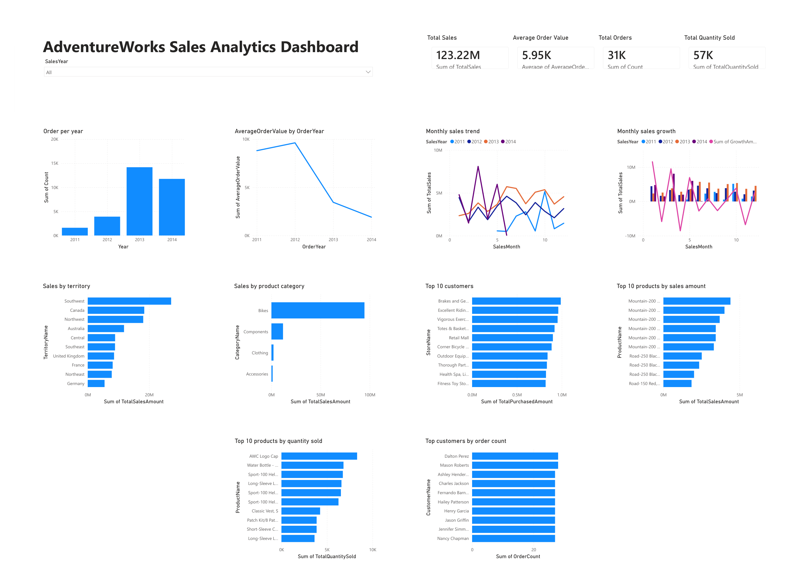
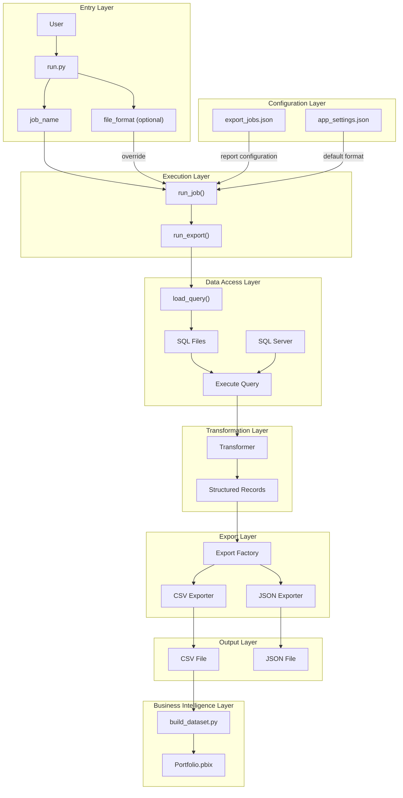

# End-to-End Data Analytics Portfolio Project

## Project Overview

This project demonstrates an end-to-end data analytics workflow using SQL Server, Python, and Power BI.

It executes analytical SQL queries, transforms the results into structured datasets, exports them in CSV or JSON format, and presents the generated data through an interactive Power BI dashboard.

The project focuses on clean architecture, modular design, and configuration-driven execution to demonstrate practical data engineering and business intelligence skills.

## Power BI Dashboard

This project includes a Power BI dashboard built on top of the generated CSV datasets.

### Dashboard Features

- Total Sales KPI
- Average Order Value KPI
- Total Orders KPI
- Total Quantity Sold KPI
- Orders per Year
- Monthly Sales Trend
- Monthly Sales Growth
- Sales by Territory
- Sales by Category
- Top Customers
- Top Products by Sales
- Top Products by Quantity
- Customer Order Count
- Year Slicer

### Data Flow

SQL Server
→ Python ETL
→ CSV
→ Power BI Dashboard


### Dashboard Preview




## Key Highlights

- End-to-end analytics workflow (SQL Server → Python → CSV → Power BI)
- Configuration-driven ETL pipeline
- SQL Server integration with Python
- Clean modular architecture
- Generic query execution engine
- Pluggable data transformation layer
- Factory pattern for export formats
- Multiple export formats (CSV and JSON)
- Interactive Power BI dashboard
- 10 analytical reports built on AdventureWorks


## Features

- Execute analytical SQL queries against SQL Server
- Transform query results into structured datasets
- Export reports in CSV or JSON format
- Generate datasets for Power BI dashboards
- Configure export jobs without changing application code
- Add new reports by creating a SQL query and a transformer
- Extend export formats using the Factory pattern
- Produce analytical reports from the AdventureWorks sample database


## Project Architecture

The following diagram illustrates the execution flow and module boundaries of the application.



## Project Structure

```text
data-portfolio/
│
├── config/
│   ├── app_settings.json
│   └── export_jobs.json
│
├── data/
│
├── powerbi/
│   ├── build_dataset.py
│   ├── Portfolio.pbix
│   └── images/
│       └── dashboard.png
│
├── python/
│   ├── run.py
│   │
│   ├── config/
│   ├── database/
│   ├── export/
│   │   └── exporters/
│   └── transform/
│
├── sql/
│
├── .gitignore
├── LICENSE
├── requirements.txt
└── README.md
```

### Python Package Overview

| Package | Responsibility |
|---------|----------------|
| `run.py` | Application entry point |
| `config` | Load application configuration |
| `database` | SQL Server connection and query loading |
| `transform` | Convert query results into structured records |
| `export` | Export pipeline orchestration |
| `export.exporters` | CSV and JSON exporters |

## Technologies

- Python 3.13
- Microsoft SQL Server
- Power BI Desktop
- pyodbc
- JSON
- CSV
- Git
- GitHub


## Installation

```bash
git clone https://github.com/resmaeeli/data-portfolio.git

cd data-portfolio

python -m venv .venv

source .venv/Scripts/activate    # Git Bash

pip install -r requirements.txt

Install Power BI Desktop if you want to open or modify the dashboard (`powerbi/Portfolio.pbix`).
```

## Configuration

The project uses two JSON configuration files.

### `config/export_jobs.json`

Each report is defined as a configuration entry.

```json
{
    "name": "orders_per_year",
    "query": "01-orders-per-year.sql",
    "transformer": "transform_orders_per_year",
    "output": "orders_per_year.csv",
    "file_format": "json"
}
```

Each job defines:

* Report name
* SQL query
* Transformer function
* Output file name
* Optional report-specific output format

### `config/app_settings.json`

Application-level settings are stored separately.

```json
{
    "default_output_format": "csv"
}
```

The output format is resolved in the following order:

1. Command-line argument
2. Report-specific configuration (`file_format`)
3. Application default setting

## Usage

Run a report using the configured output format:

```bash
python python/run.py orders_per_year
```

Override the output format from the command line:

```bash
python python/run.py monthly_sales_growth json
```

Supported output formats:

* csv
* json

Generated reports are written to the `data/` directory using the resolved output format.

Refresh all Power BI source datasets before opening the dashboard:

```bash
python powerbi/build_dataset.py
```


## Sample Output

The project generates structured reports in both **CSV** and **JSON** formats.

### Orders Per Year (CSV)

```csv
Year,Count
2011,1607
2012,3915
2013,14182
2014,11761
```

---

### Top 10 Customers (CSV)

```csv
StoreName,PersonName,TotalPurchasedAmount
Brakes and Gears,Roger Harui,989184.0820
Excellent Riding Supplies,Andrew Dixon,961675.8596
Vigorous Exercise Company,Reuben D'sa,954021.9235
Totes & Baskets Company,Robert Vessa,919801.8188
Retail Mall,Ryan Calafato,901346.8560
Corner Bicycle Supply,Joseph Castellucio,887090.4106
Outdoor Equipment Store,Kirk DeGrasse,841866.5522
Thorough Parts and Repair Services,Lindsey Camacho,834475.9271
"Health Spa, Limited",Robin McGuigan,824331.7682
Fitness Toy Store,Stacey Cereghino,820383.5466
```

---

### Monthly Sales Growth (JSON)

```json
[
    {
        "SalesYear": 2011,
        "SalesMonth": 5,
        "TotalSales": "567020.9498",
        "PreviousMonthSales": "0.0000",
        "GrowthAmount": "567020.9498"
    },
    {
        "SalesYear": 2011,
        "SalesMonth": 6,
        "TotalSales": "507096.4690",
        "PreviousMonthSales": "567020.9498",
        "GrowthAmount": "-59924.4808"
    },
    {
        "SalesYear": 2011,
        "SalesMonth": 7,
        "TotalSales": "2292182.8828",
        "PreviousMonthSales": "507096.4690",
        "GrowthAmount": "1785086.4138"
    }
]
```


## Design Highlights

- Layered project architecture with clear separation of responsibilities.
- Configuration-driven ETL execution.
- Factory pattern for export formats.
- Modular transformer architecture.
- SQL queries separated from application logic.
- Loosely coupled database, transformation, and export layers.
- Power BI dashboard built on generated datasets.


## Future Improvements

- Add additional export formats (Excel, Parquet).
- Support command-line filtering parameters.
- Add automated unit tests.
- Add logging and execution metrics.
- Package the application as an installable CLI tool.
- Add automated Power BI dataset refresh.

## License

This project is licensed under the MIT License.