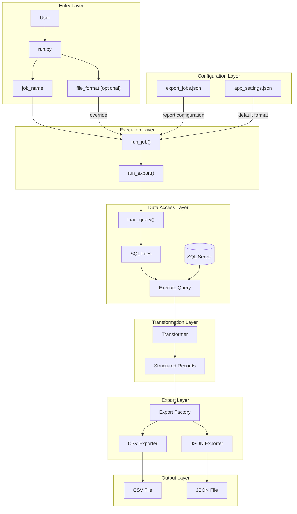

# Data Portfolio

## Project Overview

This project is a configuration-driven ETL pipeline built with Python and SQL Server. It executes analytical SQL queries, transforms the returned data into structured records, and exports the results in multiple output formats.

The project was designed with maintainability and extensibility in mind. New reports can be added through configuration without modifying the core execution pipeline, while additional export formats can be introduced by extending the export layer.

The primary goal of this project is to demonstrate clean software architecture, modular design, and practical data engineering principles in a portfolio-ready application.


## Key Highlights

* Configuration-driven ETL pipeline
* SQL Server integration with Python
* Generic query execution engine
* Pluggable data transformation layer
* Strategy and Factory patterns for export handling
* Multiple export formats (CSV and JSON)
* 10 analytical reports built on AdventureWorks
* Modular and extensible architecture


## Features

* Execute analytical SQL queries against SQL Server.
* Transform query results into structured Python records.
* Export reports to multiple output formats (CSV and JSON).
* Configure export jobs without modifying application code.
* Select output format through configuration or command-line arguments.
* Add new reports by creating a SQL query and a transformer.
* Extend export capabilities using the Strategy and Factory patterns.
* Generate analytical reports from the AdventureWorks sample database.


## Project Architecture

The following diagram illustrates the execution flow and module boundaries of the application.




## Project Structure

```text
data-portfolio/
│
├── config/
│   ├── app_settings.json
│   └── export_jobs.json
│
├── data/
│
├── python/
│   ├── run.py
│   │
│   ├── config/
│   ├── database/
│   ├── export/
│   │   └── exporters/
│   └── transform/
│
├── sql/
│
└── README.md
```

### Python Package Overview

| Module             | Responsibility                           |
| ------------------ | ---------------------------------------- |
| `run.py`           | Application entry point                  |
| `config`           | Load application and job configuration   |
| `database`         | Database connection and SQL loading      |
| `transform`        | Convert SQL rows into structured records |
| `export`           | Export pipeline orchestration            |
| `export.exporters` | CSV and JSON exporters                   |

```
```


## Technologies

## Installation

## Configuration

## Usage

## Sample Outputs

## Design Highlights

## Future Improvements

## License
