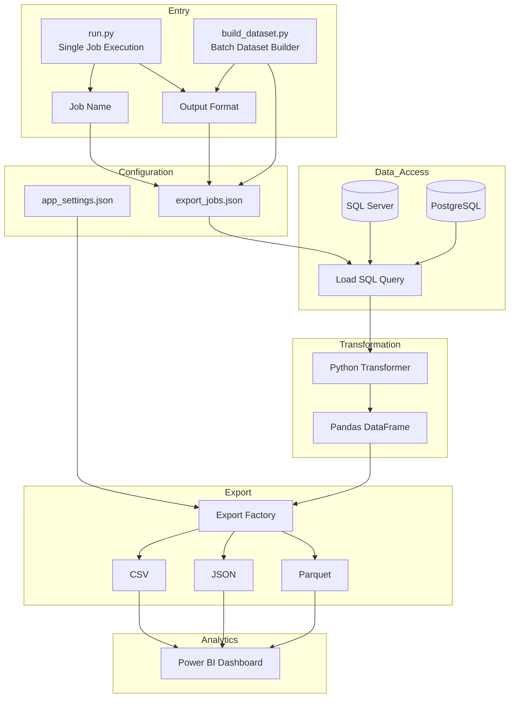

# End-to-End Data Engineering & Analytics Portfolio Project

## Project Overview

This project demonstrates an end-to-end data engineering and analytics workflow using Docker, SQL Server, PostgreSQL, Python, and Power BI.

It provides a reproducible local data environment, executes analytical SQL queries, transforms the results into structured datasets, exports them in CSV or JSON format, and presents the generated data through an interactive Power BI dashboard.

The project focuses on clean architecture, modular design, configuration-driven execution, and practical data engineering patterns.

## Dockerized Development Environment

The project provides a reproducible local data environment using Docker Compose.

The environment includes:

- SQL Server 2022 for enterprise relational data processing
- PostgreSQL 17 for open-source database workloads
- Automated database initialization
- Health checks for service readiness
- Persistent database storage using Docker volumes

Database initialization workflow:

Docker Compose
→ Container Startup
→ SQL Server Readiness Check
→ AdventureWorks Database Restore
→ PostgreSQL Pagila Initialization

## Power BI Dashboard

This project includes a Power BI dashboard built on top of the generated CSV datasets.

### Dashboard Features

- Total Sales KPI
- Average Order Value KPI
- Total Orders KPI
- Total Quantity Sold KPI
- Orders per Year
- Monthly Sales Trend
- Monthly Sales Growth
- Sales by Territory
- Sales by Category
- Top Customers
- Top Products by Sales
- Top Products by Quantity
- Customer Order Count
- Year Slicer

### Data Flow

Dockerized Data Environment

SQL Server / PostgreSQL
→ Python ETL Pipeline
→ CSV / JSON Datasets
→ Power BI Dashboard

### Dashboard Preview


## Key Highlights

- End-to-end data engineering workflow
  (Database → Python ETL → Dataset Export → Power BI)

- Dockerized reproducible data environment

- SQL Server and PostgreSQL integration

- Configuration-driven ETL pipeline

- Clean modular architecture

- Strategy pattern for transformations

- Factory pattern for export formats

- Dynamic query loading

- Multiple export formats:
  - CSV
  - JSON
  - Parquet

- Centralized application logging

- Interactive Power BI dashboard

- 20+ analytical reports across SQL Server and PostgreSQL datasets

## Features

- Execute analytical SQL queries against SQL Server and PostgreSQL
- Support multiple database environments
- Transform query results into structured datasets using Python
- Export reports in multiple formats:
  - CSV
  - JSON
  - Parquet
- Generate datasets for Power BI dashboards
- Configure export jobs without changing application code
- Add new reports by creating SQL queries and transformer modules
- Extend export formats using the Factory pattern
- Use configuration-driven ETL execution
- Produce analytical reports from AdventureWorks and Pagila sample databases

## Project Architecture

The following diagram illustrates the execution flow and module boundaries of the application.


## Project Structure

```text
data-portfolio/
│
├── config/
│   ├── app_settings.json
│   ├── db_config.json
│   └── export_jobs.json
│
├── db/
│   ├── sqlserver/
│   │   ├── 01-orders-per-year.sql
│   │   ├── 02-top-10-customers.sql
│   │   └── analytical queries...
│   │
│   └── postgresql/
│       ├── 01-top-actors-by-film-count.sql
│       ├── 02-film-category-analysis.sql
│       └── analytical queries...
│
├── docker/
│   └── init/
│       ├── sqlserver/
│       │   ├── entrypoint.sh
│       │   ├── setup.sh
│       │   ├── restore.sql
│       │   └── backup/
│       │       └── AdventureWorks2022.bak (ignored by Git)
│       │
│       └── postgres/
│           ├── init.sql
│           └── backup/
│               └── pagila.sql
│
├── powerbi/
│   ├── build_dataset.py
│   ├── Portfolio.pbix
│   └── images/
│       └── dashboard.png
│
├── python/
│   ├── run.py
│   ├── config/
│   ├── database/
│   ├── export/
│   │   └── exporters/
│   ├── transform/
│   └── utils/
│
├── data/
│   └── generated datasets (ignored by Git)
│
├── logs/
│   └── runtime logs (ignored by Git)
│
├── scripts/
│   └── setup.ps1
│
├── docker-compose.yml
├── .gitignore
├── .gitattributes
├── LICENSE
├── requirements.txt
└── README.md
```

### Python Package Overview

| Package | Responsibility |
|---------|----------------|
| `run.py` | Application entry point and command-line execution |
| `config` | Load and manage application and export job configurations |
| `database` | Manage database connections and load SQL query files |
| `transform` | Transform query results into structured analytical datasets |
| `export` | Orchestrate dataset export workflow |
| `export.exporters` | Provide export implementations for CSV, JSON, and Parquet formats |

## Technologies

- Docker
- Docker Compose
- Microsoft SQL Server 2022
- PostgreSQL 17
- Python 3.13
- Power BI Desktop
- pyodbc
- Linux Shell Scripts
- PowerShell
- Git
- GitHub
- JSON
- CSV
- Parquet


## Installation

### Prerequisites

Required tools:

- Docker Desktop
- Docker Compose
- Python 3.13
- Power BI Desktop (optional)

### Clone Repository

```bash
git clone https://github.com/resmaeeli/data-portfolio.git

cd data-portfolio
```


### Start Data Infrastructure
Start the Dockerized database environment:

```bash
docker compose up -d
```

This starts:

- Microsoft SQL Server 2022
- PostgreSQL 17


The initialization workflow automatically performs:

- SQL Server readiness validation
- AdventureWorks2022 database restore
- PostgreSQL Pagila database initialization
- Database healthcheck validation

### Setup Python Environment

Create a virtual environment:
```bash
python -m venv .venv
```

Activate the environment using Git Bash:
```bash
source .venv/Scripts/activate
```
Install Python dependencies:

``` bash
pip install -r requirements.txt
```

### Power BI Dashboard (Optional)

Install Power BI Desktop if you want to open or modify the dashboard:

`powerbi/Portfolio.pbix`


## Configuration

The project uses two JSON configuration files.

### `config/export_jobs.json`

Each report is defined as a configuration entry.

```json
{
    "name": "orders_per_year",
    "query": "01-orders-per-year.sql",
    "transformer": "transform_orders_per_year",
    "output": "orders_per_year.csv",
    "file_format": "json"
}
```

Each job defines:

* Report name
* SQL query
* Transformer function
* Output file name
* Optional report-specific output format

### `config/app_settings.json`

Application-level settings are stored separately.

```json
{
    "default_output_format": "csv"
}
```

The output format is resolved in the following order:

1. Command-line argument
2. Report-specific configuration (`file_format`)
3. Application default setting

## Usage

Run a report using the configured output format:

```bash
python python/run.py orders_per_year
```

Override the output format from the command line:

```bash
python python/run.py monthly_sales_growth json
```

Supported output formats:

* csv
* json

Generated reports are written to the `data/` directory using the resolved output format.

Refresh all Power BI source datasets before opening the dashboard:

```bash
python powerbi/build_dataset.py
```


## Sample Output

The project generates structured datasets in **CSV**, **JSON**, and **Parquet** formats.

### Orders Per Year (CSV)

```csv
Year,Count
2011,1607
2012,3915
2013,14182
2014,11761
```

---

### Top 10 Customers (CSV)

```csv
StoreName,PersonName,TotalPurchasedAmount
Brakes and Gears,Roger Harui,989184.0820
Excellent Riding Supplies,Andrew Dixon,961675.8596
Vigorous Exercise Company,Reuben D'sa,954021.9235
Totes & Baskets Company,Robert Vessa,919801.8188
Retail Mall,Ryan Calafato,901346.8560
Corner Bicycle Supply,Joseph Castellucio,887090.4106
Outdoor Equipment Store,Kirk DeGrasse,841866.5522
Thorough Parts and Repair Services,Lindsey Camacho,834475.9271
"Health Spa, Limited",Robin McGuigan,824331.7682
Fitness Toy Store,Stacey Cereghino,820383.5466
```

---

### Monthly Sales Growth (JSON)

```json
[
    {
        "SalesYear": 2011,
        "SalesMonth": 5,
        "TotalSales": "567020.9498",
        "PreviousMonthSales": "0.0000",
        "GrowthAmount": "567020.9498"
    },
    {
        "SalesYear": 2011,
        "SalesMonth": 6,
        "TotalSales": "507096.4690",
        "PreviousMonthSales": "567020.9498",
        "GrowthAmount": "-59924.4808"
    },
    {
        "SalesYear": 2011,
        "SalesMonth": 7,
        "TotalSales": "2292182.8828",
        "PreviousMonthSales": "507096.4690",
        "GrowthAmount": "1785086.4138"
    }
]
```


## Design Highlights

- Layered project architecture with clear separation of responsibilities.
- Configuration-driven ETL execution.
- Factory pattern for export formats.
- Modular transformer architecture.
- SQL queries separated from application logic.
- Loosely coupled database, transformation, and export layers.
- Power BI dashboard built on generated datasets.


## Future Improvements

- Add automated unit tests
- Support command-line filtering parameters
- Package the application as an installable CLI tool
- Add automated Power BI dataset refresh
- Extend data validation capabilities

## License

This project is licensed under the MIT License.